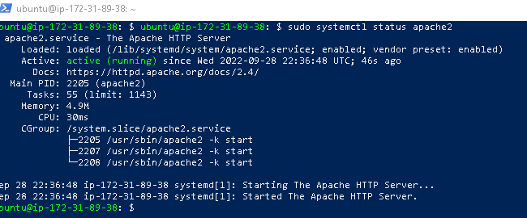

# AWESOME DOCUMENTATION FOR PROJECT_1 - LAMP


## This project is about installing web stack application using lamp(linuxapache mysql php).
\
___
## __Installation for ubuntu-linux OS__
___

### __The installation of the linux OS is done on aws platform__
\
### __After setting up your aws EC2 instance, next you lauch the instance by adding security group.__
\
### __When adding security group, create a new security group, then set inbound and outbound rules__

* __inbound rules__
    * set ssh at port 22, all trafic at 0.0.0.0
    * set http at port 80, all trafic at 0.0.0.0
* __outbound rules__
    * set all trafic for all

## __ssh into the VM from powershell terminal__
__First navigate to where you kept the .pem file__

__Then__

```ssh -i <private-key-name>.pem ubuntu@<Public-IP-address>```

## _Run the following commands on Powershell for apache, mysql and php setup_
\
---
## __Installation for apache__
___
```
sudo apt update

sudo apt install apache2
```

### #__verify apache2 status__
```
sudo systemctl status apache2
```
## *__Result:__

---


---
\
## #__Add TCP:80 and SSH:22 Ports on AWS security group inbound rules__


__Check for connectivity on ubuntu shell by:__
```curl http://localhost:80```

__Test Apache HTTP server on web browser__
```http://<ipv4 of VM>:80```

__*Result:__

\
___
## __Installation for Mysql__
___
```sudo apt install mysql-server```

### #__login into mysql__

```sudo mysql```

### *__Result:__


\
### #__Change native password__

```ALTER USER 'root' @'localhost' IDENTIFIED WITH mysql_native_password BY 'PassWord.1' ;```

### #__Logout of  mysql__

```mysql > exit```

### #__Run the security script to validate password__
```sudo mysql_secure_installation```

### _put in a new password, then tpye y for all._
__*Result:__


### #__Login to the MYSQL console__

`sudo mysql -p`

\
___
## __Installation for php__
___

### __--start php by installing it, first--__
```sudo apt install php libapache2-mod-php php-mysql```

### __confirm php installation/version__
```php -v```

__*Result:__

\
## __Creation of a virtual host__

### _The domain name is setup by creatiing directories_

__Directory for projectlamp__

```sudo mkdir /var/www/projectlamp```

__Next, assign ownership to projectlamp directory.__

```sudo chown -R $USER:$USER /var/www/projectlamp```

__create and configure sites-available directory__
```sudo vi /etc/apache2/sites-available/projectlamp.conf```

__copy this and paste in this file.__

```
<VirtualHost *:80>
    ServerName projectlamp
    ServerAlias www.projectlamp 
    ServerAdmin webmaster@localhost
    DocumentRoot /var/www/projectlamp
    ErrorLog ${APACHE_LOG_DIR}/error.log
    CustomLog ${APACHE_LOG_DIR}/access.log combined
</VirtualHost>
</IfModule>
```

__print contain of this file__

```sudo ls /etc/apache2/sites-available```

__Enable a new virtual host__

```sudo a2ensite projectlamp```

__Disable default comand__

```sudo a2issite 000-default```

__Test the file__

```sudo apache2ctl configtest```

__Reload apache to effect changes__

```sudo systemctl reload apache2```

__open browser and check out this using__

```http://<ipv4>:80```
### __OR__

```http://localhost:80```

__*Expected Result:__

\
## __Enabling  of php on the website__
To do this rearrange directoryindex of html and php

```sudo vim /etc/apache2/mods-enabled/dir.conf```

__copy and paste this in the file__

```
<IfModule mod_dir.c>
        #Change this:
        #DirectoryIndex index.html index.cgi index.pl index.php index.xhtml index.htm
        #To this:
        DirectoryIndex index.php index.html index.cgi index.pl index.xhtml index.htm
</IfModule>
```

__Reload apache__

```sudo systemctl reload apache2```

__create index.php file by typing this command__

```vim /var/www/projectlamp/index.php```

__type this into this file__

```
<?php

phpinfo();

```
__Reload the website.__

Expected Result:


_Remove index.php file for security and privacy issues._

`sudo rm /var/www/projectlamp/index.php`

## __Congratulation done and dusted with LAMP__